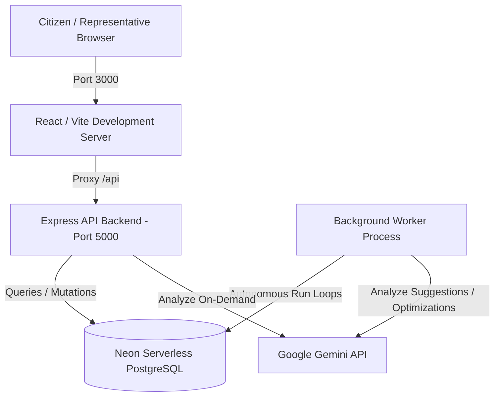
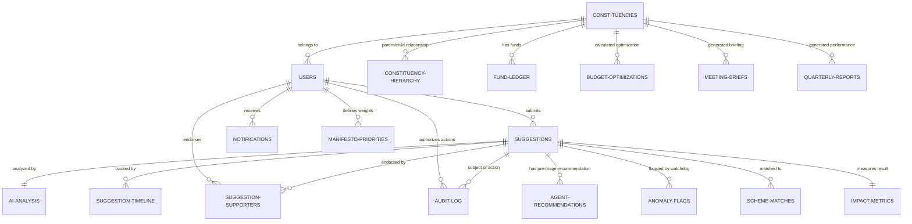

# 🗳️ People's Priorities

> **AI-Powered Civic Advocacy and Legislative Management Platform**
>
> A state-of-the-art civic engagement system bridging the gap between citizens and their parliamentary representatives (MPs/MLAs). The platform leverages Google Gemini models to automatically ingest, categorize, deduplicate, and prioritize public development demands—giving citizens a direct voice while providing elected representatives with data-driven decision-making tools, optimized budget allocation suggestions, meeting briefings, and performance analytics.

---

## 📖 Table of Contents
1. [Core Value Proposition](#-core-value-proposition)
2. [Architectural Overview](#-architectural-overview)
3. [Technology Stack](#-technology-stack)
4. [Agentic AI Swarm (Background Worker)](#-agentic-ai-swarm-background-worker)
5. [Role-Based Access Control (RBAC)](#-role-based-access-control-rbac)
6. [Data Model & Entity Relationships](#-data-model--entity-relationships)
7. [Installation & Local Setup](#-installation--local-setup)
8. [Developer Runbooks & Troubleshooting](#-developer-runbooks--troubleshooting)
9. [API Endpoints Reference](#-api-endpoints-reference)
10. [Sample Login Credentials](#-sample-login-credentials)

---

## 🌟 Core Value Proposition

In large democratic setups, the communication channel between citizens and legislators is often fractured. Petitions get lost in paperwork, minor localized issues are drowned out by loud campaigns, and representatives struggle to balance tight budgets against constituency demands. 

**People's Priorities** solves this by:
*   **Structuring Unstructured Voice & Text Data**: Ingestion of citizen reports via multi-lingual voice recordings or free-text descriptions, automatically transcribed and parsed.
*   **Democratic Demand Accumulation**: Tracking upvotes, signatures, and duplicate clusters to calculate a live **Demand Priority Score** per issue.
*   **Constrained Resource Optimization**: Helping representatives run mathematical allocations on their local development funds to maximize community benefits.
*   **Legislative Briefings & Accountability**: Synthesizing high-demand items into meeting agendas and comparing actual spending against stated campaign manifestos.

---

## 🏗️ Architectural Overview

The application is structured as a dual-server full-stack project:



*   **Frontend SPA (Port 3000)**: Serves the visual dashboards, map visualizations, suggestion ledgers, and transcription inputs.
*   **Express API Backend (Port 5000)**: Houses API controllers, handles authentication sessions, manages audits, and updates budgets.
*   **Background Worker (Separate Process)**: Runs an interval loop invoking 8 specialized autonomous AI agents to execute batch analytics, cross-reference state policies, and flag suspicious activities.

---

## 💻 Technology Stack

### Frontend
*   **Core Framework**: React 19, TypeScript, Vite (v6)
*   **Styling**: Tailwind CSS (v4) with Custom Glassmorphism Theme
*   **Animations**: Framer Motion
*   **Icons**: Lucide React
*   **Mapping & Geospatial**: Leaflet & React Leaflet

### Backend & Background Worker
*   **Runtime & Server**: Node.js, Express
*   **Database Client**: `pg` (node-postgres) with SSL connection parameters
*   **File Uploads**: Multer (In-memory buffer processing)

### AI & Large Language Models
*   **Engine**: Google Gemini SDK (`@google/genai`)
*   **Primary Models**: `gemini-2.0-flash` (for high-volume triage & transcription) & `gemini-3.5-flash` (for reasoning & structured JSON outputs)

---

## 🤖 Agentic AI Swarm (Background Worker)

The project includes a robust background worker (`backend/src/worker.js`) running a parallel execution cycle to perform asynchronous tasks. The worker runs 8 specialized agents:

| Agent Name | Trigger | Action / Logic |
| :--- | :--- | :--- |
| **1. Continuous Re-Scoring Agent** | Continual (Interval) | Computes suggestion priority scores dynamically based on: $Score = Severity + (Upvotes \times 3) + (Duplicates \times 5) + NeglectFactor$. |
| **2. Autonomous Pre-Triage Agent** | On new suggestions | Performs in-context historical matching. Recommends `approve`, `reject`, or `defer` actions based on past MP decisions logged in the audit trail. |
| **3. Scheme Cross-Reference Agent** | On new suggestions | Matches incoming demands (e.g., streetlights, pipes) against official government development schemes (Jal Jeevan, PMGSY, SBM, etc.) using Gemini. |
| **4. Anomaly & Manipulation Watch** | On last 50 submissions | Audits descriptions and timelines to detect coordinated duplicate campaigns, bot spam, and astroturfing. Flags anomalies in `anomaly_flags`. |
| **5. Budget Allocation Optimizer** | Per constituency | Performs a multi-variable knapsack analysis to suggest a combination of proposed projects that maximizes beneficiary coverage and priority scores within budget bounds. |
| **6. Legislative Meeting-Prep Agent** | Per constituency | Collates the top 5 unresolved high-demand proposals, summarizes citizen sentiments, and drafts concise talking points for the MP's town halls. |
| **7. Autonomous Quarterly Auditing** | Per constituency | Compares actual approved and funded projects against the MP's stated manifesto commitments, calculates alignment scores, and notes category imbalances. |
| **8. Escalation Watchdog Agent** | Continual | Scans for suggestions in `Submitted` or `Proposed` status older than 7 days, auto-escalates their status, and fires a SLA breach notification to the MP. |

---

## 🔐 Role-Based Access Control (RBAC)

The platform enforces rigid user roles to ensure security, compliance, and user-appropriate interface experiences:

### 👤 Citizen Role (`CITIZEN`)
*   **Access**: Public suggestion portal.
*   **Key Actions**:
    *   Record voice complaints (transcribed on the fly).
    *   Pin issues on the Leaflet map.
    *   Upvote/Endorse neighboring demands.
    *   Track the live status timeline of their submissions.

### 🏛️ Representative Role (`MP` / `MLA`)
*   **Access**: Analytical Legislative Dashboard.
*   **Key Actions**:
    *   Review AI-triaged proposals and matched government schemes.
    *   Execute operations: **Approve** (deducts funds from Ledger), **Reject**, **Defer**, or **Request Info** (updates timelines).
    *   Read AI-generated meeting briefs and budget allocation suggestions.
    *   Compare performance metrics against manifesto weights.

### 🛡️ Administrative Role (`ADMINISTRATOR`)
*   **Access**: Full system control.
*   **Key Actions**:
    *   Review security logs and security flags (astroturfing alerts).
    *   Configure baseline constituency metrics and constituency hierarchies.

---

## 📊 Data Model & Entity Relationships

The PostgreSQL schema utilizes relational integrity and indexes to support high-throughput operations. The following diagram illustrates the relational layout:



---

## ⚙️ Installation & Local Setup

### Prerequisites
*   **Node.js**: v18.0.0 or higher
*   **Database**: PostgreSQL instance (Neon Serverless PostgreSQL recommended)
*   **Google Gemini API Key**: Valid key from Google AI Studio

### Step 1: Clone and Install Dependencies

```bash
# Clone the repository
git clone https://github.com/<your-username>/peoples-priorities.git
cd peoples-priorities

# Install backend dependencies
cd backend
npm install

# Install frontend dependencies
cd ../frontend
npm install
```

### Step 2: Database Migration

Before starting the server, seed your PostgreSQL schema.

1.  Connect to your PostgreSQL client.
2.  Execute the base schema file `schema.sql` (found in the root directory) to initialize the tables.
3.  Execute the alteration schema `alteration.sql` to apply the authentication and RBAC patches.
4.  Navigate to the `backend` folder and run the migration scripts to initialize the audit log, ledgers, and AI-agent tables:
    ```bash
    cd backend
    npm run test-db # Verify connection parameters
    node scripts/run-migrations.js
    node scripts/run-agent-migrations.js
    ```

### Step 3: Configure Environment Variables

Create `.env` files in both backend and frontend directories:

#### **Backend Config (`backend/.env`)**
```env
PORT=5000
DATABASE_URL=postgresql://<user>:<password>@<neon-host>/<db-name>?sslmode=verify-full
GEMINI_API_KEY=AIzaSy... # Obtained from Google AI Studio
CLIENT_URL=http://localhost:3000
GOOGLE_CLIENT_ID=your-google-client-id.apps.googleusercontent.com
GOOGLE_CLIENT_SECRET=your-google-client-secret
GOOGLE_CALLBACK_URL=http://localhost:5000/api/auth/google/callback
```

#### **Frontend Config (`frontend/.env`)**
```env
GEMINI_API_KEY=AIzaSy... # Used for client-side Gemini triggers
APP_URL=http://localhost:5000
```

---

## 🚀 Running the Application

For a fully operational system, you need to spin up the **Backend API**, the **Background Agent Worker**, and the **Frontend dev server**:

### Running the Backend
From the `backend` folder:
```bash
# Run in development mode (auto-restarts via nodemon)
npm run dev
```

### Running the Background Worker
From the `backend` folder in a new terminal window:
```bash
# Runs the agent loops immediately, then schedules them for every 3 minutes
npm run worker
```

### Running the Frontend
From the `frontend` folder in a new terminal window:
```bash
# Runs the Vite application served on port 3000
npm run dev
```

---

## 🛠️ Developer Runbooks & Troubleshooting

### 1. Port Conflicts (`EADDRINUSE`)
If port `5000` is already in use by a ghost node process:
*   The backend startup script automatically executes `scripts/kill-port.js` to clear port 5000.
*   You can manually clear it by running:
    ```bash
    node scripts/kill-port.js
    ```

### 2. Vite WebSocket & HMR Connection Issues
During heavy hot module reloads, you might notice console warnings about WebSocket connections failing.
*   In `frontend/vite.config.ts`, HMR is configured to disable file-watching when `DISABLE_HMR=true` to save CPU resources.
*   If running behind local firewalls, make sure the default Vite HMR port (`24678`) is unblocked. You can adjust the host parameter in the config file to explicitly target `localhost`.

---

## 🔌 API Endpoints Reference

### Authentication `/api/auth`
*   `GET /api/auth/login`: Serves the aesthetic login landing page.
*   `GET /api/auth/google`: Initiates Google OAuth consent.
*   `GET /api/auth/mock`: Developer bypass login (generates mock MP user in local session).
*   `POST /api/auth/login`: Logs in using credentials.
*   `POST /api/auth/signup`: Registers a new user.
*   `POST /api/auth/logout`: Destroys the active session token.
*   `GET /api/auth/me`: Retrieves current session context.

### Proposals `/api/proposals`
*   `GET /api/proposals`: Lists all constituency requests (supports filters: `category`, `status`, `min_budget`, `max_budget`, `sort_by`).
*   `GET /api/proposals/:id`: Gets details of a specific proposal.
*   `POST /api/proposals/:id/action`: Action endpoint for MP (Accepts `approve`, `reject`, `defer`, `escalate`, `comment`). Requires comments and logs immutable events to `audit_log`.
*   `GET /api/proposals/:id/audit-trail`: Fetches the audit records for a proposal.
*   `POST /api/proposals/:id/explain-ranking`: Calls Gemini to generate a 2-sentence rationale for the demand score ranking.
*   `POST /api/proposals/:id/draft-response`: Drafts a formal response to the citizens using AI.
*   `PATCH /api/proposals/:id/recommend`: Submits staff-level recommendations and notes.

### Ledger & Insights
*   `GET /api/funds`: Retrieves the constituency fund ledger (`total_fund`, `committed`, `remaining`).
*   `GET /api/scheme-match`: Classifies suggestions and matches them against legislative funds.
*   `GET /api/dashboard/stats`: Aggregates constituency performance indices and constituency health scores.
*   `GET /api/dashboard/bias-flags`: Highlights underserved areas (wards with high demand but low historical funding).

---

## 🔑 Sample Login Credentials

To facilitate rapid verification and testing, the login system automatically seeds the following credentials if they are missing from the database:

| Role | Username / Email | Password | Role Features |
| :--- | :--- | :--- | :--- |
| **Member of Parliament (MP)** | `mp@assembly.gov` | `password123` | Full administrative dashboard, budget approval, optimization reports. |
| **Administrator** | `admin@assembly.gov` | `password123` | Security monitoring, astroturfing flags, configuration oversight. |
| **Citizen** | `citizen@assembly.gov` | `password123` | Suggestion submission portal, upvoting/endorsing interface, map view. |

---
*Developed as a democratic civic-advocacy tool. Designed for community-first leadership.*
